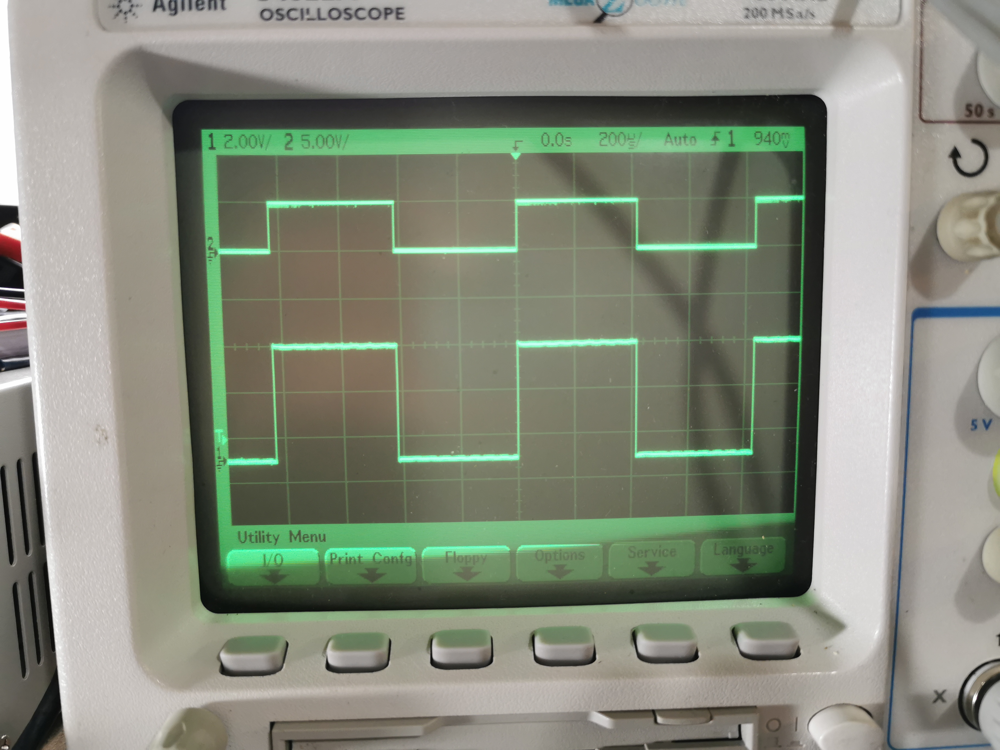
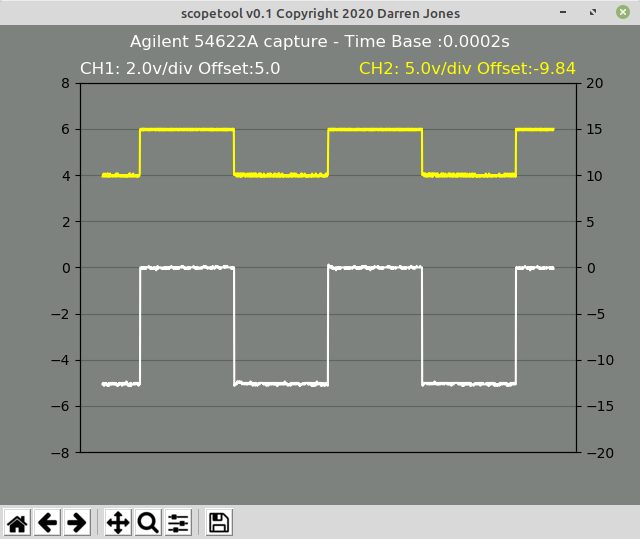

Agilent Oscilloscope Tools (scopetool)
======================================

About
-----

scopetool is a small python program to retrieve captured data from Agilent
oscilloscopes

Currently Supported Models:

-  54621A
-  54622A
-  54624A
-  54641A
-  54642A
-  54621D
-  54622D
-  54641D
-  54642D

Installation
------------

There is no specific installation needed, however the tool requires the following Python modules

`matplotlib <https://matplotlib.org/>`
`PySerial <https://pythonhosted.org/pyserial/>`

Usage
-----------

Once installed, you should be able to run the tool at the command line
using:

```
usage: scopetool [-h] [-1] [-2] [--port USB_PORT] [--speed USB_SPEED]
```

For example:
```
$ scopetool -p /dev/ttyUSB0 -s 57600 -1 -2
```

Screenshots
-----------

The scope



And corresponding capture



